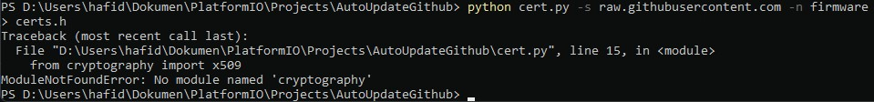

# ESP8266-Update-Program-over-HTTPS
Program for updating esp8266 firmware over https (ota over https). In this project i updated esp8266 program from github.

## Arduino IDE
If using Arduino IDE rename the [source code](https://github.com/hafidh7/ESP8266-Update-Program-over-HTTPS/blob/master/src/main.cpp) (main.cpp) in [src](https://github.com/hafidh7/ESP8266-Update-Program-over-HTTPS/tree/master/src) folder to main.ino and copy [certs.h](https://github.com/hafidh7/ESP8266-Update-Program-over-HTTPS/blob/master/include/certs.h)  to same folder

## certs.h  
to get certs.h  
1. install [phyton3](https://www.python.org/)
2. open terminal go to [cert.py](https://github.com/hafidh7/ESP8266-Update-Program-over-HTTPS/blob/master/cert.py) directory
3. input command
```yaml
python cert.py -s raw.githubusercontent.com -n firmware > certs.h
```
or
```yaml
python3 cert.py -s raw.githubusercontent.com -n firmware > certs.h
```
### Error No module named 'cryptography'  
  
install cryptography

```yaml
python -m pip install cryptography
```

## .bin file (firmware)
To get [.bin](https://github.com/hafidh7/ESP8266-Update-Program-over-HTTPS/blob/master/.pio/build/nodemcuv2/firmware.bin) file   
- Arduino IDE   
go to sketch choose export compile binary
- PlatformIO VSCode   
go to .pio/build/nodemcuv2/
